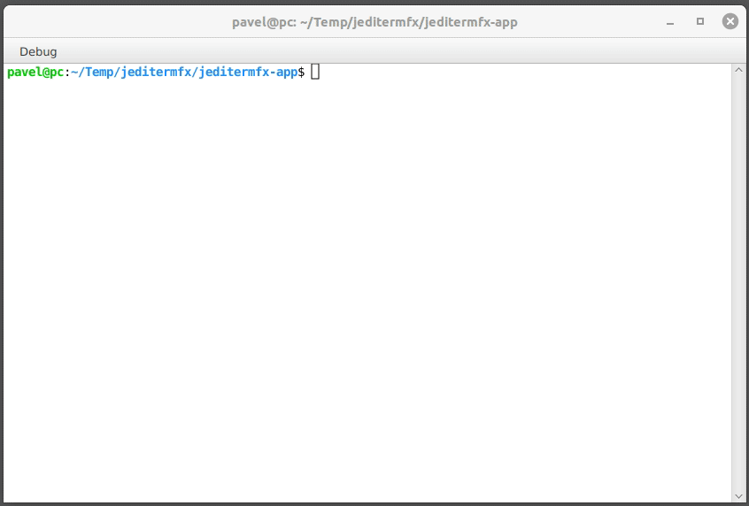

# JediTermFX
* [Overview](#overview)
* [Demo](#demo)
* [Features](#features)
* [Terminal Comparison](#comparison)
* [Usage](#usage)
    * [Hyperlinks](#usage-hyperlinks)
* [Code building](#code-building)
* [Running the Application](#application)
    * [Using Maven](#application-maven)
    * [Using Distro](#application-distro)
* [License](#license)
* [Feedback](#feedback)

# Overview 

JediTermFX is a Terminal Emulator for JavaFX. The project is a result of porting
[JediTerm](https://github.com/JetBrains/jediterm) (commit 8366f2b) from Swing to JavaFX. JediTermFX exclusively
utilizes JavaFX components. Therefore, the Terminal Emulator based on this library can be seamlessly integrated into
any JavaFX application. A detailed comparison of terminal libraries is provided below.

# Demo 

# Features 

* Local terminal for Unix, Mac and Windows using Pty4J
* Xterm emulation - passes most of tests from vttest
* Xterm 256 colours
* Scrolling
* Copy/Paste
* Mouse support
* Terminal resizing from client or server side
* Terminal tabs

# Terminal Comparison 

Terminal      | JediTermFX  | [JediTerm](https://github.com/JetBrains/jediterm)  | [TerminalFX](https://github.com/javaterminal/TerminalFX) |
:-------------|:----------- |:--------------|:--------------|
GUI Library   | JavaFX      | Swing         | JavaFX        |
Main Component| Canvas      | JComponent    | WebView       |
Languages     | Java        | Java, Kotlin  | Java, JS      |
JPMS Support  | Yes         | No            | Yes           |

# Usage 

It is recommended to start working with JediTermFX by studying and running the
[BasicTerminalShellExample](jeditermfx-app/src/main/java/pk/jeditermfx/app/example/BasicTerminalShellExample.java) class.
This class contains the minimal code needed to launch a terminal in a JavaFX application.

## Hyperlinks 

JediTermFX provides a wide range of features when working with links. The `HighlightMode` enumeration specifies multiple
modes of working with links and their colors. In the `ALWAYS` modes, links are always underlined and always clickable.
In the `NEVER` modes, links are never underlined and never clickable. In the `HOVER` modes, links become underlined and
clickable only when hovered over. Now let's clarify the difference between the two types of colors. `CUSTOM` colors
are those set by the JediTermFX user in the getHyperlinkColor() method of the settings. `ORIGINAL` colors are those
offered by the program running in the terminal. Thus, links can use either custom colors or the original text colors.

# Code Building 

To build the library use standard Git and Maven commands:

    git clone https://github.com/PavelKastornyy/jeditermfx
    cd jeditermfx
    mvn clean install

# Running the Application 

The project contains a demo application that shows how to use this library. There are two ways to run the application.

## Using Maven 

To run application using maven plugin execute the following commands in the root of the project:

    cd jeditermfx-app
    mvn javafx:run

Please note, that debugger settings are in `jeditermfx-app/pom.xml` file.

## Using Distro 

After building the project, you will find a distribution archive named `jeditermfx-version-app.tar` in the
`jeditermfx-app/target` directory. Extracting this file will allow you to launch the application using `.sh` or `.bat`
scripts depending on your operating system.

# License 

JediTermFX is dual-licensed under both the LGPLv3 (found in the LICENSE-LGPLv3.txt file in the root directory) and
Apache 2.0 License (found in the LICENSE-APACHE-2.0.txt file in the root directory). You may select, at your option,
one of the above-listed licenses.

# Feedback 

Any feedback is welcome. Besides, it would be interesting to know for what cases this project is used. It will
help to understand the way the project should go and provide more information in documentation.

